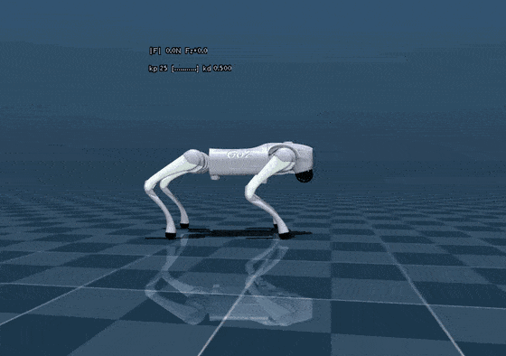
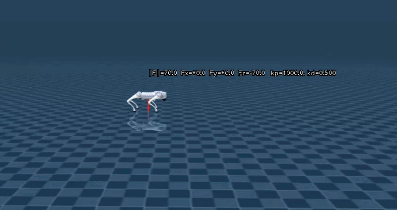
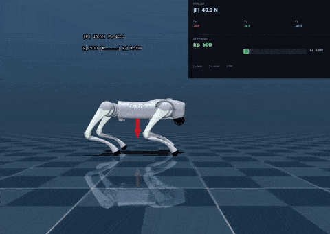
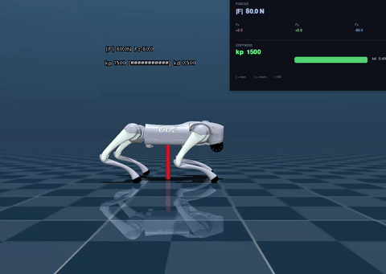
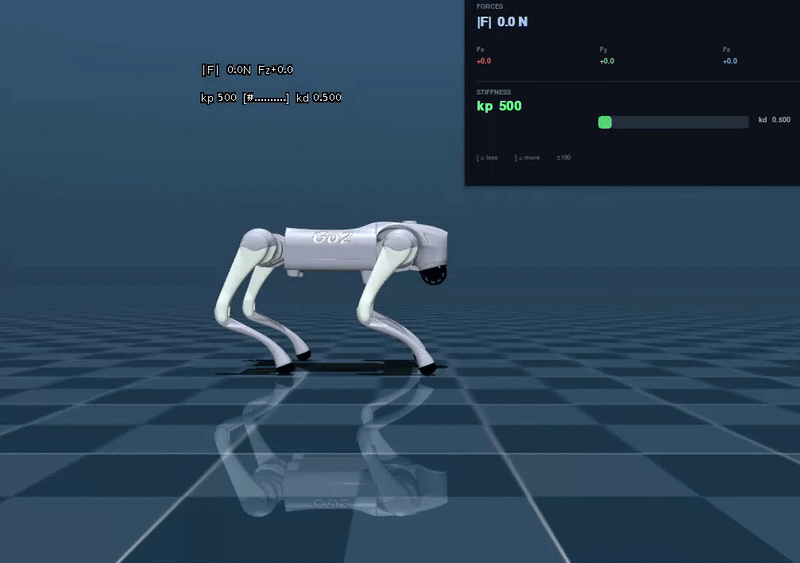
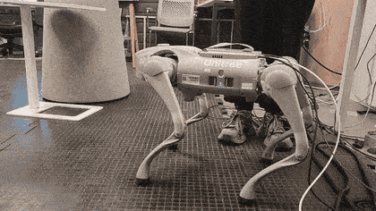

# Compliance design for quadruped RL-based locomotion

## Overview

Reinforcement learning locomotion for the Unitree Go2 with task-space compliance, plus deployment tooling for MuJoCo simulation and real hardware.

**Problem:** RL policies behave rigidly under external perturbations (for example when contacting objects or humans), which can create safety concerns.



**Solution:** Admittance-inspired motion modulation integrated into a single locomotion policy:

- ❌ No additional sensors or external compliance controllers
- ✅ One policy handles locomotion and compliance together

**Example of compliant walk**



**Results:** Compliance level is set via `stiffness_command` and can also be changed online at runtime.

Stiffness command in simulation:

| Stiffness | Behavior |
|-----------|----------|
| 500 |  |
| 1500 |  |

Online stiffness change during deployment:



**Hardware tests:**




**Implementation details:**

- Simulator: Isaac Lab, 4096 parallel environments
- Timestep: 5 ms; control frequency: 50 Hz (`sim.dt = 0.005`, `decimation = 4`)
- Algorithm: PPO actor-critic
- Evaluation: MuJoCo simulation and Unitree Go2 hardware


## Compliance architecture

The compliance module computes deformations induced by external forces in task space at the center of mass (CoM). Force-induced motion is modeled as a virtual mass-spring-damper (MSD) system:

```
M*q'' + D*q' + K*q = F_ext
```

For stability: `D = 2 sqrt(MK)`. The policy is rewarded for tracking these deformed states.

During training, external forces are applied to the CoM as RL events. `ComplianceManager` (see `src/compliance/compliance_manager.py`) integrates the MSD model; parameters live in `compliance_manager_cfg.py`. Stiffness is commanded via `stiffness_command` and resampled during training so the policy learns multiple compliance levels.

Task configs:
- Soft walking: `src/modules/tasks/compliant_walk_env_cfg.py`
- Compliant stance: `src/modules/tasks/compliant_stance_env_cfg.py`
- Flat walking: `src/modules/tasks/flat_walk_env_cfg.py`

## Supported tasks

| Task ID | Environment config | Description |
|---------|-------------------|-------------|
| `go2_walk_flat` | `flat_walk_env_cfg.py` | Walking on flat terrain |
| `go2_soft_walk` | `compliant_walk_env_cfg.py` | Soft compliant walking |
| `go2_compliant_stance` | `compliant_stance_env_cfg.py` | Compliant stance under external forces |
| `go2_compliant_stance_fixed_stiffness` | `compliant_stance_fixed_stiffness_env_cfg.py` | Compliant stance with fixed stiffness |
| `go2_default_stance` | `stance_env_cfg.py` | Default standing pose |

## Requirements

Training requires an NVIDIA GPU. Tested with:

| Package | Version |
|---------|---------|
| Isaac Sim | `5.1.0.0` |
| Isaac Lab | `v2.3.1` |
| rsl-rl-lib | `3.0.1` |
| Python | `3.11` |
| CUDA drivers | `>= 525` |

See the [Isaac Lab pip installation guide](https://isaac-sim.github.io/IsaacLab/main/source/setup/installation/pip_installation.html) for Isaac Sim setup details.

## Installation

**Training** — run the setup script (conda env, Isaac Sim, Isaac Lab, RSL-RL, this project):

```bash
bash setup_train.sh
conda activate env_isaaclab
```

**Deployment (MuJoCo)** — Dockerized; dependencies are installed in the container. Source is bind-mounted, so code changes apply without rebuilding.

```bash
cd deploy/docker
docker compose build   # first time only (~15 min)
```

## Training

```bash
conda activate env_isaaclab

python scripts/train.py --task=go2_compliant_stance --num_envs=4096 --max_iterations=5000 --headless
python scripts/train.py --task=go2_soft_walk --num_envs=4096 --max_iterations=5000 --headless
```

Visualize a trained policy in Isaac Sim:

```bash
python scripts/play.py --task=go2_compliant_stance --num_envs=4
```

## Deployment

**MuJoCo (Docker)** — auto-resolves the latest policy checkpoint for the task:

```bash
cd deploy/docker
docker compose run --rm quadruped-policy go2_soft_walk
docker compose run --rm quadruped-policy go2_compliant_stance

# Override duration or starting stiffness
DURATION=60 docker compose run --rm quadruped-policy go2_soft_walk
CMD_ARGS="stiffness_commands=500.0" docker compose run --rm quadruped-policy go2_soft_walk

# Change stiffness at runtime (second terminal)
python deploy/stiffness_client.py --stiffness 500.0
```

**Real hardware:**

```bash
python deploy/deploy.py \
    --policy logs/rsl_rl/unitree_go2_walk_soft/2026-05-06_00-20-12/exported/policy.pt \
    --config deploy/configs/soft_walk.yaml \
    --interface eth0 --domain 0
```

## Citation

If you use this work, please cite:

```bibtex
@misc{mozhegova2026force_adaptive,
  title         = {Force-Adaptive Policies for Robust and Safe Quadruped Locomotion},
  author        = {Ekaterina Mozhegova and Simeon Nedelchev},
  year          = {2026},
  url           = {https://github.com/illusoryTwin/compliant-quadruped-locomotion},
}
```

## License

This project is licensed under the **BSD 3-Clause License** — see [LICENSE](LICENSE).

Training scripts derived from [Isaac Lab](https://github.com/isaac-sim/IsaacLab) follow the same license terms.
